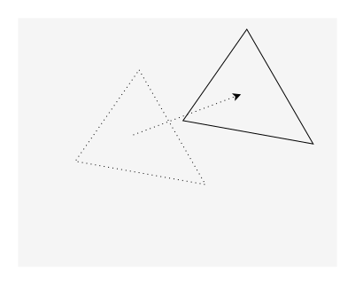
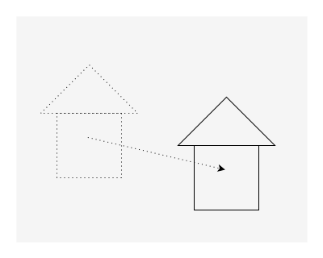
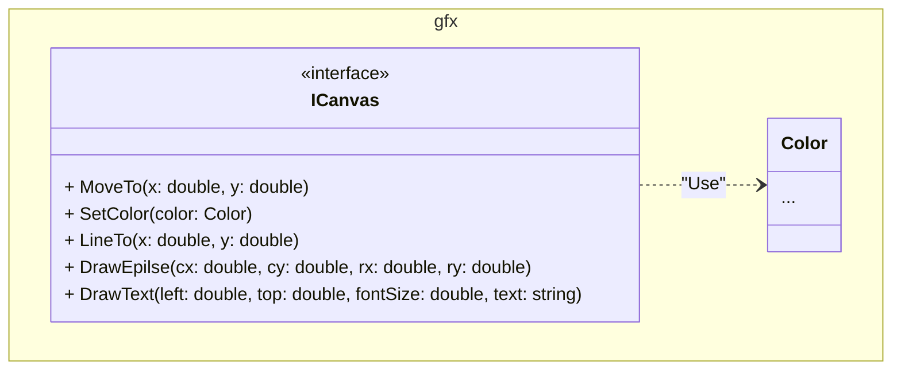

## Задание 4 — Программа с фигурами

### 4.1 Базовый функционал (250 баллов)

Напишите консольную программу Shapes, в которой можно создавать композицию из различных геометрических фигур.
Композиция создаётся при помощи команд, поступающих со стандартного потока ввода.
Подумайте самостоятельно, где и как применить паттерн "Стратегия" в этом задании.

#### Команда `AddShape`

Добавляет фигуру. Синтаксис команды:

```txt
AddShape <id> <цвет> <тип> <параметры>
```

- `<id>` — строка, задающая идентификатор фигуры. Идентификатор используется для управления фигурой в последующих командах.
- `<цвет>` — строка в формате `#RRGGBB`, задающая цвет фигуры, где `R`, `G`, `B` - цифры шестнадцатеричной системы счисления.
  Например `#FFff00` задаёт жёлтый цвет.
- `<тип>` — задаёт тип фигуры. У каждой фигуры свой набор параметров.
- `<параметры>` — одно или несколько значений, разделённых пробелами, задающих параметры создаваемой фигуры.
  Тип и количество параметров варьируются в зависимости от типа фигуры.

Например, следующая команда добавляет окружность розового цвета с id, равным `sh1`,
с центром в точке (100, 110) и радиусом 15:

```txt
AddShape sh1 #ff00ff circle 100 110 15 
```

Если фигура с таким id уже существует, выдать сообщение об ошибке.

##### Окружность (circle)

Окружность задаётся координатами центра и радиусом. Все параметры — числа с плавающей запятой. Радиус должен быть неотрицательным.

```txt
circle <x> <y> <r>
```

Пример:

```txt
AddShape circ #febb38 circle 100 200 25
```

##### Прямоугольник (rectangle)

Прямоугольник задаётся координатами верхнего левого угла, шириной и высотой. Все параметры — числа с плавающей запятой.
Ширина и высота должны быть неотрицательными.

```txt
rectangle <left> <top> <width> <height>
```

Пример команды вставки прямоугольника:

```txt
AddShape sh1 #123456 rectangle 10 20 30 40
```

##### Треугольник (triangle)

Треугольник задаётся координатами вершин. Все числа — параметры с плавающей запятой.

```txt
triangle <x1> <y1> <x2> <y2> <x3> <y3>
```

Пример команды вставки треугольника:

```txt
AddShape tr1 #00fefe triangle 0 0 10 0 0 10
```

##### Отрезок прямой (line)

Отрезок прямой линии задаётся координатами начала и конца.

```txt
line <x1> <y1> <x2> <y2>
```

Пример команды добавления линии:

```txt
AddShape ln1 #fefefe line 10 20 35 -88
```

##### Текст (text)

Текст задаётся координатами левого верхнего угла, размером шрифта и текстом надписи.
Координаты текста и размеры шрифта — числа с плавающей запятой.
Размер должен быть неотрицательным. Текст — строка символов до конца строки.

```txt
text <left> <top> <размер> <тест>
```

Пример команды вставки текста:

```txt
AddShape txt1 #ffaa88 text 100.3 100.2 12.8 Hello world
```

#### Команда MoveShape

Сдвигает указанную фигуру вдоль вектора (dx, dy). dx и dy - числа с плавающей запятой. Размеры фигуры не изменяются.
Синтаксис команды:

```txt
MoveShape <id> <dx> <dy>
```



#### Команда MovePicture

Сдвигает всю композицию вдоль вектора (dx, dy), как если бы команда `MoveShape` была применена ко всем фигурам композиции.
dx и dy - числа с плавающей запятой. Синтаксис команды:

```txt
MovePicture <dx> <dy>
```



#### Команда DeleteShape

Удаляет фигуру с указанным id. Синтаксис команды.

```txt
DeleteShape <id>
```

Если фигуры с таким id не существует, выдать сообщение об ошибке.

В программе ссылки на остальные фигуры должны оставаться валидными.
То есть если получить ссылку на фигуру `sh1`, а потом удалить фигуру предшествующую или следующую за ней,
ссылка на фигуру `sh1` должна остаться валидной.

#### Команда List

Выводит список фигур. Фигуры выводятся в порядке их добавления. Синтаксис команды:

```txt
List
```

Информация по каждой фигуре выводится в отдельной строке в следующем формате:

```txt
<номер фигуры> <тип> <id> <цвет> <параметры фигуры>
```

- `<номер фигуры>` — число начиная с 1
- `<цвет>` — выводится в формате `#RRGGBB`, где `R`, `G`, `B` — цифры шестнадцатеричной системы счисления.
  Регистр букв - на ваше усмотрение.

Пример:

```txt
1 circle circ1 #ff00ff 10.3 20.3 30
2 rectangle rect1 #ff00ff 10 20 35 45.5
3 triangle tr1 #ff00ff 0.5 23.5 10 25.5 35 11
4 line ln1 #ff00ff 11.2 15.3 -2.7 2.25
5 text txt1 #000000 100.3 100.2 12.8 Hello world
```

#### Команда ChangeColor

Команда `ChangeColor` изменяет цвет фигуры. Синтаксис команды:

```txt
ChangeColor <id> <цвет>
```

Цвет указывается в том же формате, что и в команде `AddShape`.

#### Команда ChangeShape

Команда `ChangeShape` изменяет тип фигуры и её параметры. Цвет и id фигуры фигуры остаётся без изменения. Синтаксис команды:

```txt
ChangeShape <id> <тип> <параметры>
```

Тип и параметры фигуры указываются в том же формате, что в команде `AddShape`.

Следующие команды добавляют прямоугольник, а затем превращают его в окружность:

```txt
AddShape sh1 #ff0000 rectangle 10 20 30 40
ChangeShape sh1 circle 100 110 15 
```

Изменение типа фигуры не должно удалять старую фигуру и вставлять новую фигуру на её место, а изменять параметры существующей.
Это означает, что если в программе получить ссылку на фигуру, а потом изменить её тип,
ссылка на оригинальную фигуру sh1 должна остаться валидной.

#### Команда DrawShape

Рисует фигуру с указанным id. Синтаксис команды:

```txt
DrawShape <id>
```

Ранее нарисованное изображение не стирается. То есть эффект команд DrawShape "накапливается"

Для рисования фигуры должны использовать интерфейс `gfx::ICanvas`. В этом интерфейсе должны быть методы, управляющие рисованием:

- `SetColor(Color c)`. Изменяет текущий цвет рисования.
- `MoveTo(double x, double y)`. Переставляет перо в точку с заданными координатами.
  Точка (x, y) становится текущей позицией рисования.
- `LineTo(double x, double y)`. Соединяет текущую позицию рисования отрезком прямой с точкой (x, y).
  Точка (x, y) становится текущей позицией рисования. Линия рисуется текущим цветом линии. Линия рисуется текущим цветом.
- `DrawEllipse(double cx, double cy, double rx, double ry)`.
  Рисует эллипс с центром в точке (cx, cy), rx - горизонтальный радиус, ry - вертикальный радиус.
  Эллипс рисуется текущим цветом. Текущая позиция рисования не меняется.
- `DrawText(double left, double top, double fontSize, const std::string& text)`.
  Рисует текст text с координатами верхнего левого угла (left, top), размерами шрифта fontSize.
  Текст выводится текущим цветом. Текущая позиция рисования не меняется.



Реализуйте этот интерфейс одним из предложенных способов:

- Графика выводится в окне. Реализацию оконной подсистемы выберите на своё усмотрение.
- Графика выводится в файл формата SVG. Формирование SVG реализуйте своими силами.
  Путь к файлу программа принимает через командную строку либо запрашивает при старте (на ваше усмотрение).
- Графика выводится в растровый файл, например PNG.
  Библиотеку для рисования растровых изображений и записи результата в файл выберите на своё усмотрение.
  Путь к файлу программа принимает через командную строку либо запрашивает при старте (на ваше усмотрение).
  Размеры растрового изображения можете использовать фиксированные, либо запрашивать у пользователя.

#### Команда DrawPicture

Рисует все фигуры композиции от первой до последней. Команда не имеет параметров:

```txt
DrawPicture
```

Ранее нарисованное изображение не стирается. То есть эффект команд `DrawPicture` "накапливается".

Для рисования должен использоваться интерфейс `gfx::ICanvas`, описанный выше.

#### Требования к архитектуре программы

- В программе выделите классы:
  - `Shape`. Моделирует фигуру. Предоставляет методы для управления фигурой и её рисования.
  - `Picture`. Моделирует сущность "Картина". Содержит методы для рисования картины, доступа к фигурам, их добавления и удаления.
  - Классы `Shape` и `Picture` должны располагаться в пространстве имён `shapes`.

    ```mermaid
    classDiagram
      namespace shapes {
        class Picture {
          ...
        }
        class Shape {
          ...
        }
      }
        Picture *-- Shape
    ```

  - Классы `Shape` и `Picture` не должны заниматься вводом-выводом.
  - Классы и интерфейсы необходимые для парсинга и обработки команд пользователя. Разместите их подходящем пространстве имён.
  - Прочие классы и интерфейсы, необходимые для реализации задания.
- Интерфейс `ICanvas` реализуйте в соответствии с предоставленными диаграммами.
- Архитектура программы должна обеспечивать лёгкость добавления новых типов фигур в будущем без изменения классов
  `Picture` и `Shape` и классов (или enum-ов), от которых они зависят.
  Представьте, что вы — автор фреймворка, и хотите, чтобы ваши пользователи могли добавлять новые типы фигур.
  Каждый раз для добавления новой фигуры вносить изменения в класс `Picture` и `Shape` вы не хотите.
  Спроектируйте программу так, чтобы это стало возможным.

### 4.2 Бонус за наличие диаграммы классов (50 баллов)

Предоставьте диаграмму классов вашей программы и связей между ними.
Диаграмму классов удобно рисовать в программе draw.io (<https://diagrams.net>).

Рекомендуется сначала спроектировать диаграмму классов, а потом по ней писать код.
Переделывать архитектуру проще, когда никакой код ещё не написан.

### 4.3 Бонус за возможность копирования фигуры (30 баллов)

Реализуйте команду `CloneShape`, добавляющую дубликат указанной фигуры.
Добавленная фигура имеет те же свойства, что и оригинальная фигура, но другой id. Синтаксис команды:

```txt
CloneShape <id> <new-id>
```

Операции над дубликатом фигуры не оказывают никакого влияния на оригинал.

Если `<new-id>` совпадает с id существующей фигуры, выдать сообщение об ошибке и не создавать дубликат.

**Подсказка**: здесь вам пригодится паттерн проектирования "Прототип" (Prototype). Изучите лекцию по этому паттерну самостоятельно.

Подумайте, как можно реализовать возможность создавать копию класса `Picture`?
Копия картины содержит копию фигур. Модификация копии картины не оказывает влияния на оригинал и наоборот.

### 4.4 Бонус за покрытие кода тестами (50 баллов)

Для `Shape` и `Picture` должны быть написаны юнит-тесты.
Написание тестов для остальных классов остаётся на ваше усмотрение.
Для тестирования методов рисования создайте mock-объект холста.

